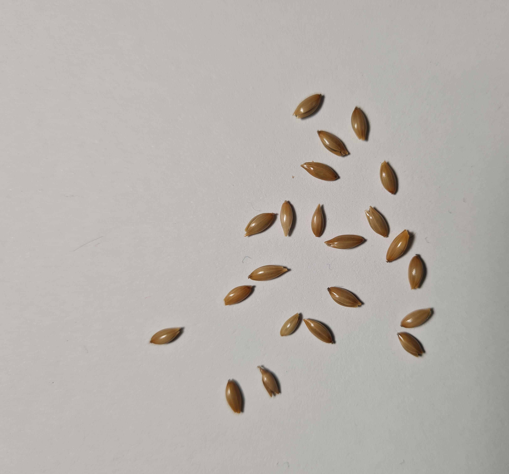
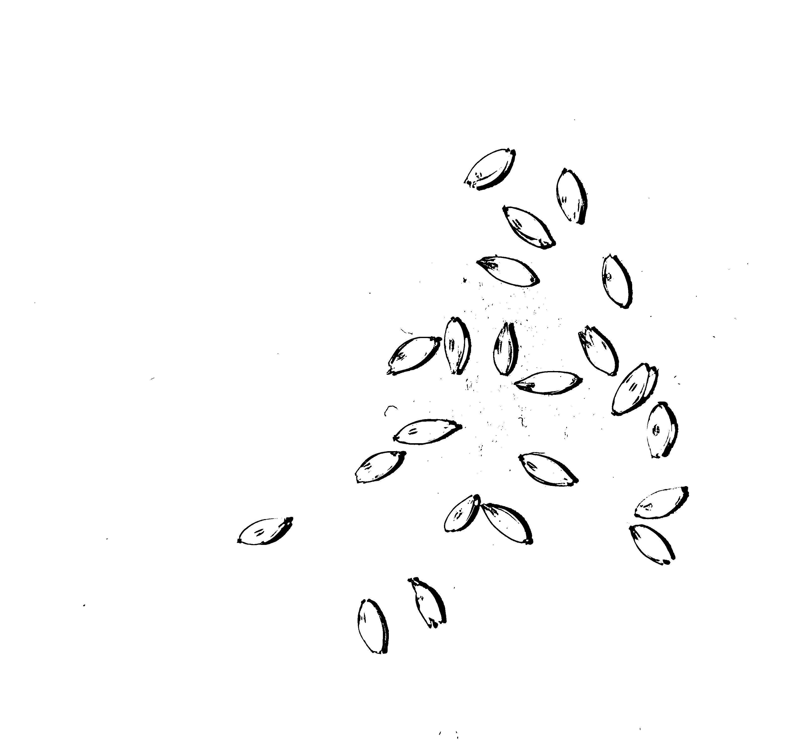
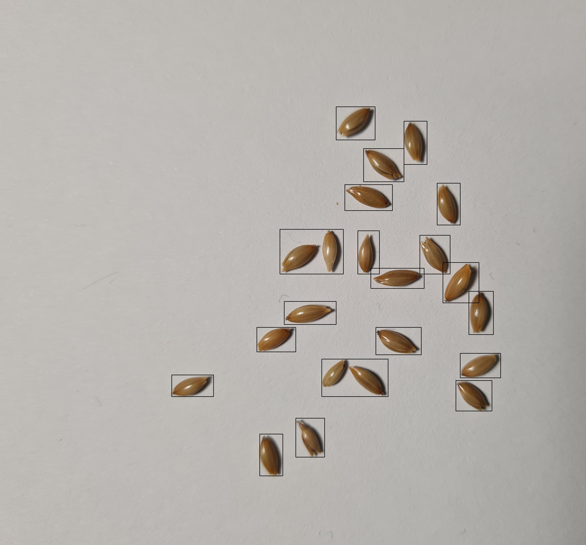

# seeds_on_a_plate

## Overview

The aim is to detect outlier seeds in a sample of a supposedly homogeneous 
population. I imagine my approach is going to be quite overkill but that's fine 
as I want to learn my computer-vision and deep learning concepts.

My initial approach is going to fine tune a pre-trained DNN (i.e. EfficientNet) 
on different kinds of seeds. Once fine-tuned I'll use the DNN to create 
embeddings which can then be used to compute distance from every other seed in 
a given photo. My thinking is that by fine-tuning on enough types of seeds with 
different shapes/sizes, the DNN will learn good representations that can then 
be used for outlier detection. This most definetely would be do-able by just 
segmenting seeds and computing known variables to run outlier detection on 
but eh, this seems fun :)

This repo is heavily a work in progress with not much structure to it.
I've done very litte image processing before, so the resulting code is
quite messy and lacks domain expertise (both computer vision and biology wise).

## TODO:
* Get bounding box code finalised to extract decent bounding boxes with little
    oversight
* Take way more seed photos (with more variation)
* Initial embedding creation
* Create image augmentation pipeline
* Demonstrate performance

## Notebooks in the repo
### segmentation.ipynb
Initial exploration notebook for looking at bounding box extraction.
This was my first notebook I think? I tried masking and then running DBSCAN
over the mask to get my groups. From there I ran some area filters on the 
DBSCAN clusters. It worked OK but was for sure convoluted and not a very good 
approach
(i.e. cv2.findConnectedComponents on a mask does just that without DBSCAN).

Could not deal with shadows.

### seed_contrasting.ipynb
Explorating into the removing of shadows as the first approach would suffer 
from shadows being present. This notebook ended in me finding me a good 
filter for dealing with shadows.

### shadows.ipynb
Probably should rename this but this notebook was to finalise the image 
processing pipeline for bounding box extraction. Stil a work in progress 
but I've got a good baseline for bounding box etraction, just need to make 
it configurable for different seeds. (and then onto training !!)

Current pipeline:

